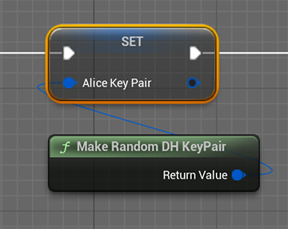
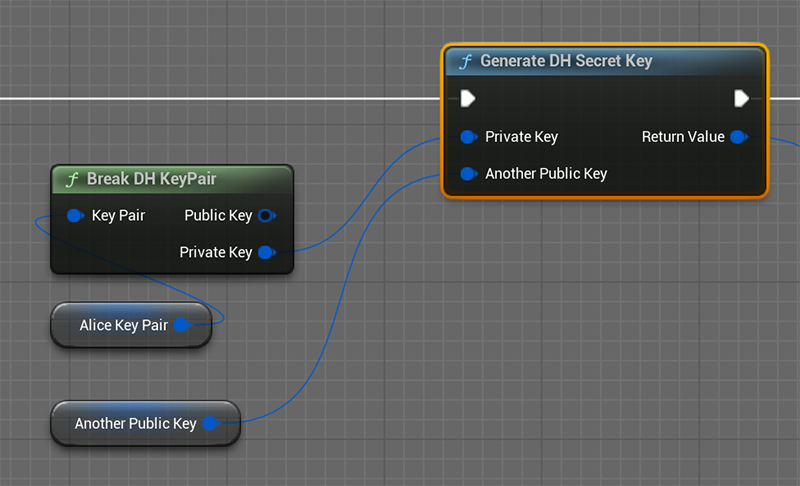

# DH Key Exchange and TEA Encryption

## 1. Introduction

In 1976, two American mathematicians, Whitfield Diffie and Martin Hellman, were the first to publish a method to solve the key transmission problem. Therefore, this method is commonly referred to as the Diffie-Hellman key exchange algorithm. This algorithm proposes such a practice: "Before encrypted communication, both parties generate part of the password separately, then exchange and combine them to form the final password."  
The DH key exchange algorithm uses the principle of irreversibility of discrete logarithm calculations in mathematics. The communication parties first generate a pair of public and private keys, then exchange public keys, and finally calculate a common key. In this way, the key does not appear in network communication, protecting the safety of both communication parties.  
  

After the key exchange, the communication parties can use a certain encryption algorithm to encrypt the communication content. Since the security of the key is guaranteed, the encryption algorithm does not need to be too complex. In most cases, the TEA algorithm can meet the requirements.  
The TEA(Tiny Encryption Algorithm) is a block cipher notable for its simplicity of description and implementation, typically a few lines of code. It was designed by David Wheeler and Roger Needham of the Cambridge Computer Laboratory in 1994.

## 2. Installation

Ensure the plugin is installed in your Unreal Engine project. Usually, this involves copying the plugin into the Plugins folder of your project and enabling it through the 'Plugins' menu in the Unreal Editor.  


## 3.Using in C++ 

1. Add “**TinyEncrypt**” to PublicDependencyModuleNames in your project's Build.cs file.  
2. Include the header file in your C++ files. For example: 
```cpp
#include "TinyEncryptKeyExchange.h"
#include "TinyEncryptAlgorithm.h"
```

3. Generate random key pair
```cpp
//Generate key pair
FDiffieHellmanKeyPair KeyPair;
KeyPair.GenerateRandomKeyPair();
```

4. Through other methods, the public keys generated by the communication parties are exchanged with each other, generally, this is done through TCP communication.  
5. Calculate the secret key using the key pair you generated and the public key received from the other party.
```cpp
FUInt128Ex SecretKey = KeyPair.GenerateSecretKey(AnotherPublicKey);
```

6. Create a TEA encryption object using the secret key
```cpp
FTinyEncrypt TEA(SecretKey);
```

7. Call the `TEA.Encrypt()` function to encrypt data. Before encrypting the data, you need to prepare a memory to save the encrypted data. The length of this memory can be obtained by calling `TEA.GetEncryptLength()`. Since the TEA algorithm encrypts in units of 8 bytes, the length of the encrypted data will be larger than before encryption, but the increased part will not be more than 8 bytes.
```cpp
const uint8* PlainText = (const uint8*)"Hello,World!";
const int32 PlainTextLen = TCString<char>::Strlen((const char*)PlainText);
//make sure kMaxOutputLength>=FTinyEncrypt::GetEncryptLength(PlainTextLen)
uint8 EncryptOutputBuff[kMaxOutputLength] = {0}
TEA.Encrypt(PlainText, PlainTextLen, EncryptOutputBuff);
```

8. Call the TEA.Decrypt function to decrypt data. Similarly, the memory size required to save the decrypted data can be obtained by calling TEA.GetDecryptLength.
```cpp
//make sure kMaxOutputLength>=FTinyEncrypt.GetDecryptLength(EncryptLength)
uint8 DecryptOutputBuff[kMaxOutputLength] = {0}
TEA.Decrypt(EncryptDataBuff, EncryptLength, DecryptOutputBuff);
```

## 4. Using in Blueprints

1. Generate random key pair  


2. Calculate the secret key using the key pair you generated and the public key received from the other party.  


3. Use the generated secret key to encrypt and decrypt data.  

